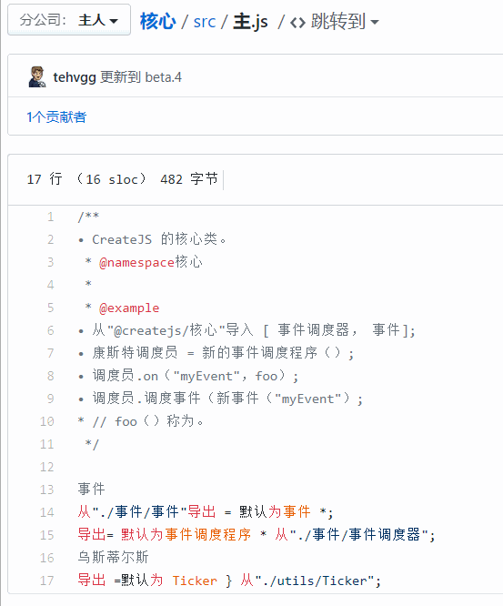

# 恢复被浏览器错误翻译的文本块脚本

经过浏览器翻译的内容，可以通过此脚本，调出选择器，选中的翻译文本块将会被恢复。

## 背景

因为有些网站的开发并不规范，没有把代码包含在 code 标签里面。由此导致使用浏览器翻译时，会把代码一并翻译。因此，为了解决这个问题，开发了这个油猴脚本。

## 使用说明

1. 按下快捷键 `Ctrl + Alt + R`，即会在右上角显示一个按钮，相同快捷键可隐藏按钮。
2. 点击按钮进入选择模式，移动鼠标，可以根据高亮内容确定当前选择的文本块，再次点击按钮则退出选择模式。
3. 如果你的网页已经经过浏览器翻译，那么将鼠标移动到要取消翻译的文本块上方点击，即可恢复为未恢复状态。
4. 你也可以通过 `Ctrl + Alt + D`，直接开启或关闭选择模式。
5. 如果恢复失败，提示`无法找到该标签的未翻译内容`，则取消翻译后按下 `Ctrl + Alt + E` 再翻译。一般用于应对内容是网页开启后 Ajax 请求得到的。

> 此功能不适用于翻译开启后通过 Ajax 请求获取的内容。可以通过取消翻译后，按下 `Ctrl + Alt + E` 来解决。

## 其他

Icons made by [Freepik](https://www.flaticon.com/authors/freepik) from [www.flaticon.com](https://www.flaticon.com/)